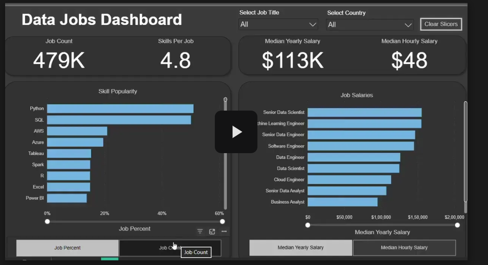

# Data Analyst Job Market Analysis Using SQL With Dashboard

## Interactive Dashboard

▶ Click the image above to watch the dashboard walkthrough video.

## Overview

This project explores the data analyst job market using SQL by analyzing job postings, salaries, and required skills.

The goal is to identify:

- Top-paying data analyst jobs
- Skills required for high-paying roles
- Most in-demand skills
- Highest-paying skills
- Skills that provide the best combination of demand and salary

The analysis is based on a real-world job postings dataset containing information on salaries, companies, locations, and required skills.

---

## Project Objectives

The project answers the following business questions:

1. What are the highest-paying Data Analyst jobs?
2. What skills are required for those jobs?
3. Which skills are most in demand?
4. Which skills are associated with the highest salaries?
5. What are the most optimal skills to learn based on salary and demand?

---

## Tools Used

| Tool | Purpose |
|--------|---------|
| SQL | Data analysis and querying |
| PostgreSQL | Database management |
| Visual Studio Code | Query development |
| Git | Version control |
| GitHub | Project hosting and collaboration |

---

## Database Structure

The project uses the following tables:

### job_postings_fact
Contains job posting information:

- Job ID
- Job Title
- Company ID
- Salary
- Location
- Work Type
- Posting Date

### company_dim

Contains company information:

- Company ID
- Company Name

### skills_dim

Contains skill information:

- Skill ID
- Skill Name

### skills_job_dim

Bridge table connecting jobs and skills.

---

# Analysis

---

## 1. Top Paying Data Analyst Jobs

### Objective

Identify the highest-paying remote Data Analyst roles.

### SQL Concepts Used

- Filtering
- LEFT JOIN
- Sorting
- LIMIT

### Key Findings

- Top salaries ranged from **$184,000 to $650,000**
- Companies such as Meta, SmartAsset, and AT&T offered highly competitive compensation
- Job titles ranged from Analyst positions to Director-level analytics roles

### Business Insight

Remote data analyst positions can command exceptionally high salaries, particularly in technology and finance sectors.

---

## 2. Skills Required for Top Paying Jobs

### Objective

Determine which skills are most frequently requested among the highest-paying jobs.

### SQL Concepts Used

- Common Table Expressions (CTEs)
- INNER JOIN
- Aggregation

### Key Findings

| Skill | Frequency |
|---------|----------|
| SQL | 8 |
| Python | 7 |
| Tableau | 6 |

Additional commonly requested skills:

- R
- Snowflake
- Pandas
- Excel

### Business Insight

SQL remains the foundational skill for securing high-paying analyst roles.

---

## 3. Most In-Demand Skills

### Objective

Identify the most frequently requested skills in remote Data Analyst job postings.

### SQL Concepts Used

- GROUP BY
- COUNT()
- Aggregation

### Top Skills

| Skill | Demand Count |
|---------|------------|
| SQL | 7,291 |
| Excel | 4,611 |
| Python | 4,330 |
| Tableau | 3,745 |
| Power BI | 2,609 |

### Business Insight

Employers consistently seek a combination of:

- Data querying
- Spreadsheet analysis
- Programming
- Data visualization

---

## 4. Highest Paying Skills

### Objective

Identify skills associated with the highest average salaries.

### SQL Concepts Used

- AVG()
- Aggregation
- Salary analysis

### Top Paying Skills

| Skill | Average Salary |
|---------|--------------|
| PySpark | $208,172 |
| Bitbucket | $189,155 |
| Couchbase | $160,515 |
| Watson | $160,515 |
| DataRobot | $155,486 |
| GitLab | $154,500 |
| Swift | $153,750 |
| Jupyter | $152,777 |
| Pandas | $151,821 |
| Elasticsearch | $145,000 |

### Business Insight

Skills involving:

- Big Data
- Machine Learning
- Cloud Platforms
- Data Engineering

command significantly higher salaries than traditional reporting skills.

---

## 5. Most Optimal Skills to Learn

### Objective

Identify skills that offer both:

- High demand
- High salaries

### SQL Concepts Used

- HAVING
- COUNT()
- AVG()
- Multi-column sorting

### Top Skills

| Skill | Demand Count | Average Salary |
|---------|-------------|--------------|
| Go | 27 | $115,320 |
| Confluence | 11 | $114,210 |
| Hadoop | 22 | $113,193 |
| Snowflake | 37 | $112,948 |
| Azure | 34 | $111,225 |
| BigQuery | 13 | $109,654 |
| AWS | 32 | $108,317 |
| Java | 17 | $106,906 |
| SSIS | 12 | $106,683 |
| Jira | 20 | $104,918 |

### Business Insight

The strongest opportunities exist at the intersection of:

- Cloud technologies
- Big data tools
- Modern data platforms
- Business intelligence solutions

---

# Key Insights

### Top-Paying Jobs

Remote Data Analyst roles can exceed **$650,000 annually**.

### Most Valuable Skill

SQL consistently appears as:

- Most demanded skill
- Required skill for top-paying jobs
- One of the most valuable skills to learn

### Highest Salary Premium

Specialized technologies and niche platforms command the highest average salaries.

### Career Strategy

A combination of:

- SQL
- Python
- Cloud technologies (AWS, Azure, Snowflake)
- Visualization tools (Power BI, Tableau)

provides the strongest return on investment for aspiring Data Analysts.

---

# Skills Demonstrated

### SQL

- Joins
- CTEs
- Aggregations
- Filtering
- Sorting
- HAVING Clauses

### Data Analysis

- Market analysis
- Salary benchmarking
- Demand analysis

### Database Management

- PostgreSQL
- Relational database design

### Business Intelligence

- Skill gap analysis
- Workforce trend analysis
- Compensation analysis

---

# What I Learned

Through this project I strengthened my understanding of:

- Complex SQL query development
- Multi-table joins
- Data aggregation techniques
- Salary trend analysis
- Real-world business problem solving
- Data-driven decision making

---

# Conclusion

This project demonstrates how SQL can be used to uncover meaningful insights from large-scale job market data.

The analysis shows that SQL remains the single most important skill for Data Analysts, while cloud technologies, data engineering tools, and advanced analytics platforms provide strong opportunities for salary growth.

For aspiring analysts, focusing on high-demand and high-paying skills can significantly improve employability and long-term career prospects.

---

## Future Improvements

- Add Power BI dashboard
- Create salary trend visualizations
- Compare Data Analyst, Data Scientist, and Data Engineer roles
- Build an automated ETL pipeline
- Add Python-based exploratory analysis

---

## Author

**Aryan Jain**

Aspiring Data Analyst | SQL | Power BI | Python | Data Visualization
